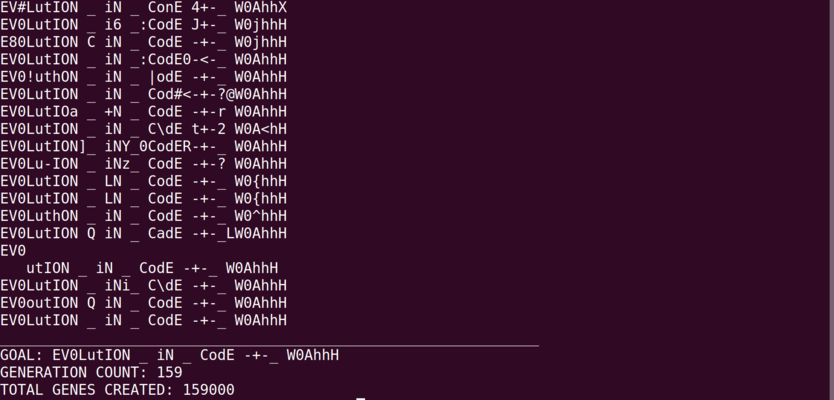
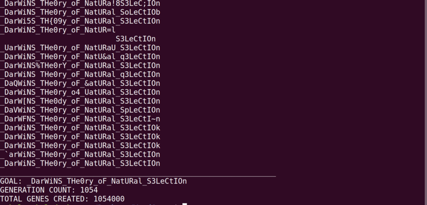

# Word Guess

Genetic algorithm to guess a word

### Preview




### How to run

```
python NaturalSelect.py "optionalWordHere"
```

### What's a genetic algorithm?

Genetic algorithms are used to solve optimization problems (ie. figuring out a word). The model is inspired by Darwin's Theory of Natural Selection.
